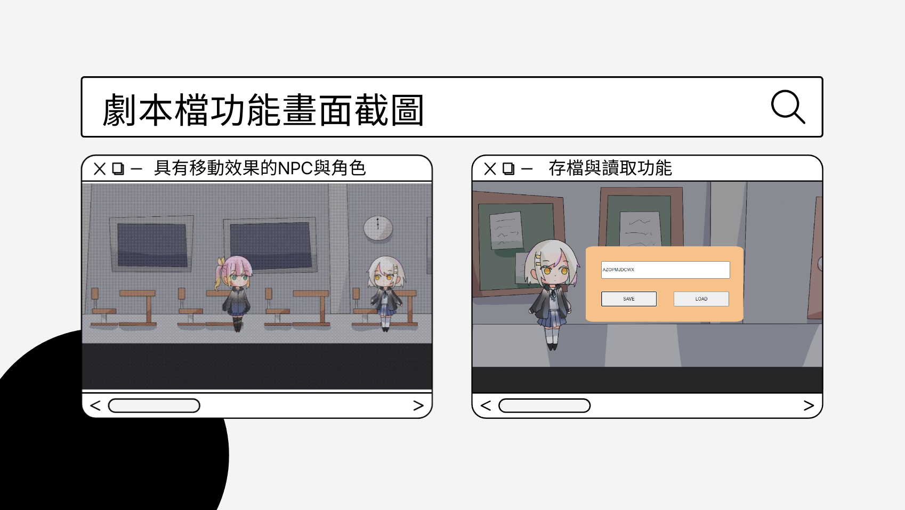
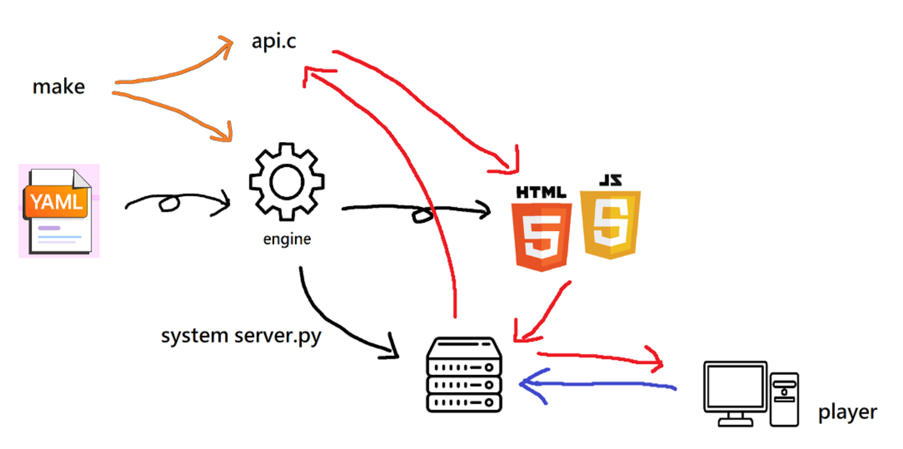

[Interactive-Fiction-Engine.c](https://github.com/NaoCoding/Interactive-Fiction-Engine.c) is a repo  which can easily transfer your idea into a website with animations. It was the final project of computer programming II in NTNU, and we improve it into a website generator. 

Basically, users can easily make a http-server based website with just a script wriiten by user.

Screenshots below are the example game written by us.

The design of the engine

