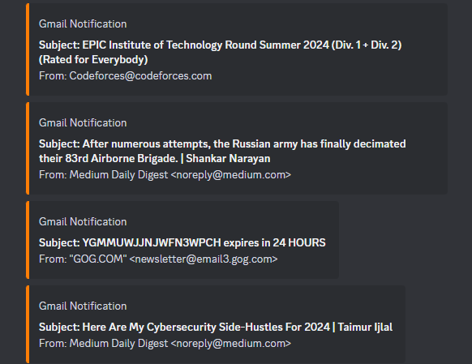

# Discord gmail notification webhook

[GitHub Repo](https://github.com/NaoCoding/discord-gmail_notification)

### Feature

Send webhook embed message while your email recieve new mail.  

### Requirement

Google Applications password 
https://myaccount.google.com/apppasswords    

Python3  
24/7 device for running python script.

### Notice

All of your mails will be marked as read after you run the script.  
You can easily just modify the code for multiple account/gmail.

